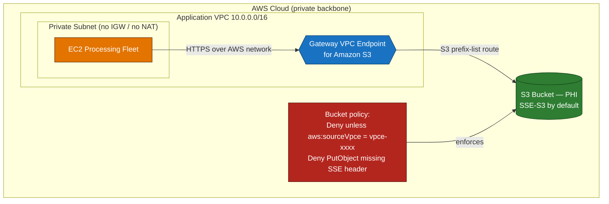
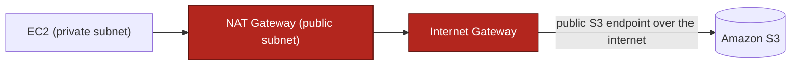
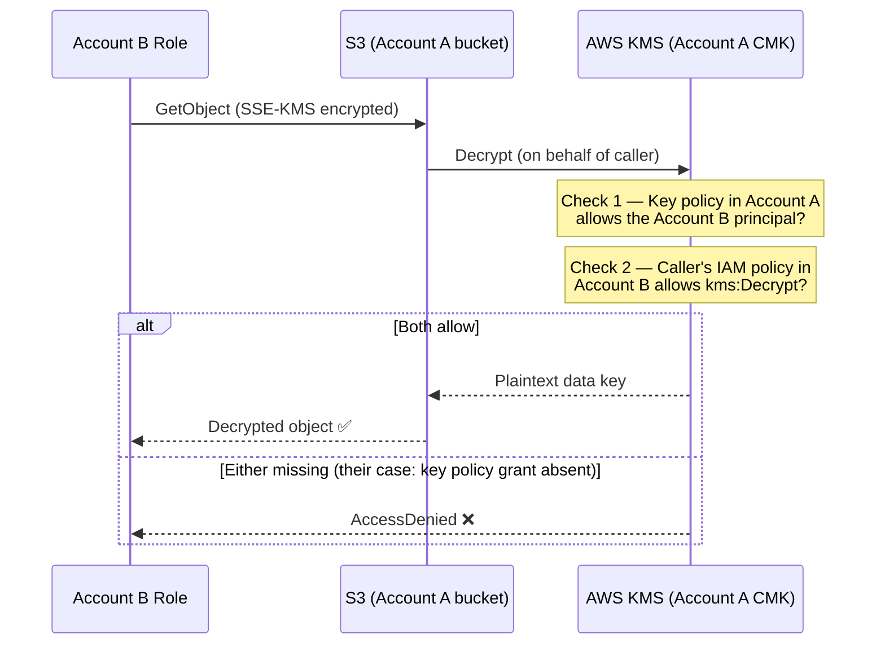
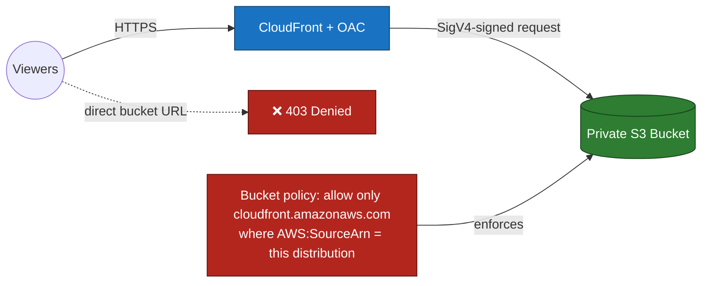
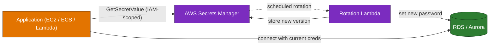
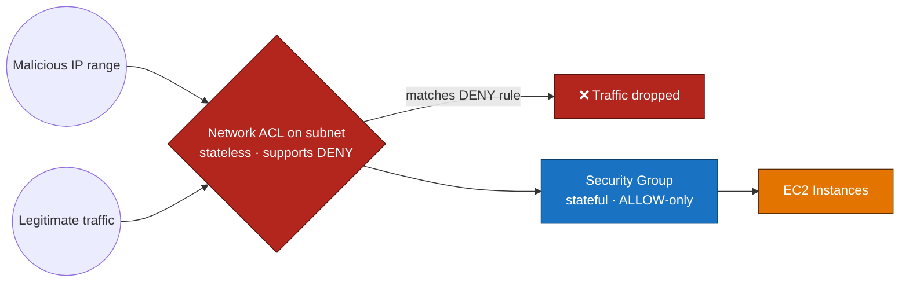
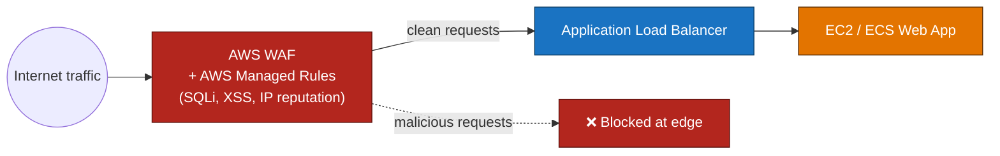

# Domain 1 — Design Secure Architectures (30%)

---

## Q1 — Private, encrypted S3 access for PHI  *(Multiple response — choose TWO)*
**Domain:** 1 — Design Secure Architectures · **Difficulty:** 🟡 Medium · **Concept:** Scope S3 access to a single VPC and enforce encryption on upload.

**Scenario:** A healthcare analytics company stores protected health information (PHI) in an Amazon S3 bucket. A fleet of EC2 instances in a **private subnet with no internet gateway and no NAT** processes these objects. Compliance mandates that (1) traffic to the bucket must **never traverse the public internet**, and **only this application's VPC** may reach the bucket; and (2) every object must be **encrypted at rest**, and any upload that does not request server-side encryption must be **rejected**. The team wants the **LEAST operational overhead**.

**Question:** Which **TWO** actions together satisfy the requirements with the LEAST operational overhead? **(Choose TWO.)**

**Options:**
- A. Create a **gateway VPC endpoint for S3** and attach a bucket policy that **denies any request where `aws:sourceVpce` is not the endpoint ID**.
- B. Route the instances' S3 traffic through a **NAT gateway** in a public subnet so they reach S3 "privately."
- C. Enable **S3 Block Public Access** and rely on it to restrict access to only the application's VPC.
- D. Attach a bucket policy that **denies `s3:PutObject` when the SSE request header is absent**, relying on S3's default SSE-S3 for encryption at rest.
- E. Create an **interface VPC endpoint** for S3 and pair it with a **public bucket ACL** so the instances can reach it.
- F. Generate **presigned URLs** for every object and distribute them to the instances.

▶ Reveal answer &amp; explanation

**✅ Correct answers: A and D**

**Concept tested:** Combining a *gateway VPC endpoint* (private path + `aws:sourceVpce` policy condition) with an *upload-time encryption guardrail*.

**Why A and D are correct:**
- **A** keeps traffic on the AWS private network (no internet path) *and* — via the `aws:sourceVpce` deny condition — ensures **only requests originating from this VPC's endpoint** can access the bucket. Gateway endpoints for S3 are added to the route table via a managed prefix list, cost nothing, and require no appliances → minimal ops. Satisfies requirement 1.
- **D** enforces requirement 2: the policy **rejects any PUT that doesn't request encryption**, and S3's default SSE-S3 guarantees objects land encrypted. Low overhead, no key management to run.

**Why the others fail:**
- **B:** A NAT gateway still egresses to the **public S3 endpoint over the internet** — it does not create a private path and does not scope access to the VPC. It also adds hourly + data-processing cost.
- **C:** Block Public Access stops *public* ACLs/policies; it does **not** restrict access to a specific VPC. A good baseline, but it doesn't meet requirement 1.
- **E:** Contradicts itself — a **public bucket ACL** violates "only this VPC," and for in-VPC S3 access the **gateway** endpoint is the standard (free) choice.
- **F:** Presigned URLs per object is enormous operational overhead and still doesn't confine access to the VPC.

**Real-world nuance / trap:** Candidates often pick Block Public Access as the "security" answer, but it's a *public* guardrail, not a network-scoping control. Confining access to a VPC is the job of the **gateway endpoint + `aws:sourceVpce`** condition.

**Time-sensitive note:** Since **January 5, 2023**, S3 applies **SSE-S3 to all new object uploads by default**, and encryption for new uploads **can no longer be disabled** ([AWS docs](https://docs.aws.amazon.com/AmazonS3/latest/userguide/default-encryption-faq.html)). So the policy in **D** now serves to *enforce a required encryption header / specific type* and reject non-conforming requests — exactly the compliance ask. (Separately, as of **April 6, 2026**, S3 disables **SSE-C** by default on new buckets.)

**Well-Architected pillar:** Security.

**Diagram — correct architecture:**

**Diagram — ❌ rejected NAT approach (Option B):**

*Traffic leaves to the public S3 endpoint and access is not confined to the VPC — fails requirement 1.*

---

## Q2 — Cross-account decryption with a customer managed KMS key
**Domain:** 1 — Design Secure Architectures · **Difficulty:** 🔴 Very Hard · **Concept:** The two-part KMS permission model for cross-account access.

**Scenario:** **Account A** owns a **customer managed KMS key** that encrypts objects in an S3 bucket in Account A. An application running under an **IAM role in Account B** must **decrypt** those objects. The security team created the role in Account B and added **`kms:Decrypt`** (scoped to the key's ARN) to that role's **identity-based IAM policy**. Decryption still fails with **`AccessDenied`**.

**Question:** What is required to grant Account B's role access **with least privilege**, and why did the current setup fail?

**Options:**
- A. Nothing more is needed — adding `kms:Decrypt` to the **Account B role's IAM policy alone** is sufficient for cross-account KMS access.
- B. **Also update the KMS key policy in Account A** to allow the Account B principal to call `kms:Decrypt` — cross-account KMS use requires **BOTH** the **key policy** (in the key's account) **AND** an **IAM policy** (in the caller's account) to allow the action.
- C. Switch the bucket to the **AWS managed key `aws/s3`** and grant Account B access to that key.
- D. Create an **IAM user with long-term access keys in Account A** and share those keys with Account B to perform the decryption.

▶ Reveal answer &amp; explanation

**✅ Correct answer: B**

**Concept tested:** For **cross-account** KMS, permission must be granted in **two places** — the **key's resource policy** *and* the **caller's identity policy**. Neither alone is enough.

**Why B is correct:** A KMS key policy is the **primary access-control document** for the key. For a principal in **another account** to use the key, the **key policy in the owning account (A)** must explicitly allow that external principal (commonly by trusting Account B's root and letting B's admins delegate via IAM), **and** the calling principal's **IAM policy in Account B** must allow the action. The current setup only did the Account B side — so KMS denies. Granting exactly `kms:Decrypt` (plus, for S3, typically `kms:GenerateDataKey` on writes) to the specific role keeps it **least privilege**.

**Why the others fail:**
- **A:** This is precisely what they already did, and it **fails**. Unlike same-account access (where the key policy can defer to IAM), cross-account access **requires the key policy to allow the external principal** as well.
- **C:** You **cannot edit the key policy of AWS managed keys** (like `aws/s3`), so you can't grant another account access to them — AWS managed keys **can't be shared cross-account**.
- **D:** Sharing **long-term access keys** across accounts is an insecure anti-pattern that violates least privilege and creates unmanaged credentials.

**Real-world nuance / trap:** The pervasive misconception is that an **IAM allow is sufficient**. It is — but **only within the same account**. The moment the principal is in a different account, the **key policy must independently authorize it**. (AWS *grants* are a third, fine-grained option, but the two-policy model is the core point.)

**Time-sensitive note:** Option C's key is an **AWS managed key**, whose rotation you can't control — AWS **rotates AWS managed keys yearly**, a schedule that **changed from every ~3 years to every ~1 year in May 2022**. Contrast with **customer managed keys**, which since **April 2024** support **configurable rotation periods of 90–2,560 days (up to 7 years)** plus **on-demand rotation** ([AWS announcement](https://aws.amazon.com/about-aws/whats-new/2024/04/aws-kms-automatic-key-rotation/)).

**Well-Architected pillar:** Security.

**Diagram — correct request/authorization flow:**

---

## Q3 — Stop users bypassing CloudFront to reach S3 directly
**Domain:** 1 — Design Secure Architectures · **Difficulty:** 🟡 Medium · **Concept:** Restricting an S3 origin so content is only reachable through CloudFront.

**Scenario:** A company serves static assets from an S3 bucket through a CloudFront distribution, where it applies AWS WAF rules and geo-restrictions. Right now the bucket is public, so anyone who learns the bucket URL can fetch objects **directly**, bypassing every edge control. The team wants users to reach content **only through CloudFront**, keeping the bucket private, with the **MOST secure** current approach.

**Question:** Which configuration is the **MOST secure**, AWS-recommended way to achieve this?

**Options:**
- A. Keep the bucket public but add a bucket policy that only allows requests carrying a secret custom `Referer` header set by CloudFront.
- B. Leave the bucket policy open (`Principal: "*"`) and rely on the CloudFront distribution to front all traffic.
- C. Make the bucket private and use **CloudFront Origin Access Control (OAC)**, with a bucket policy that allows only the `cloudfront.amazonaws.com` service principal where `AWS:SourceArn` matches the distribution ARN.
- D. Put the S3 bucket "inside" the VPC and restrict it with security groups.

▶ Reveal answer &amp; explanation

**✅ Correct answer: C**

**Concept tested:** Locking an S3 origin to a specific CloudFront distribution using **Origin Access Control**.

**Why C is correct:** OAC lets CloudFront send **SigV4-signed** requests to a **private** bucket using a CloudFront **service principal**. The bucket policy grants `s3:GetObject` only to `cloudfront.amazonaws.com` **and** conditions it on `AWS:SourceArn = <this distribution>`, so the object is reachable only via that distribution — never by guessing the bucket URL. This keeps WAF/geo controls unbypassable and protects against the confused-deputy problem.

**Why the others fail:**
- **A:** A secret `Referer` header is a weak, spoofable control and still requires a **public** bucket. Not a security boundary.
- **B:** `Principal: "*"` is literally a public bucket — the exact backdoor being removed.
- **D:** S3 is a regional service with a public API; you don't place a bucket "in a VPC" or guard it with security groups. (You *can* keep traffic private with a gateway endpoint, but that scopes access to a VPC, not to a CloudFront distribution.)

**Real-world nuance / trap:** Leaving a distribution on the **legacy OAI** is the most common stale finding. OAI still works but doesn't support SSE-KMS, all HTTP methods, or newer opt-in Regions.

**Time-sensitive note:** **OAC launched in 2022** and is **AWS's recommended method**; OAI is legacy but still supported. New designs should use OAC ([AWS docs](https://docs.aws.amazon.com/AmazonCloudFront/latest/DeveloperGuide/private-content-restricting-access-to-s3.html)).

**Well-Architected pillar:** Security.

**Diagram — correct architecture:**

---

## Q4 — Database credentials with automatic rotation
**Domain:** 1 — Design Secure Architectures · **Difficulty:** 🟡 Medium · **Concept:** Managed secret storage with built-in rotation vs. alternatives.

**Scenario:** An application connects to an Amazon RDS database using a username and password. Security policy requires the credentials to be **stored securely, retrieved by the app at runtime, and rotated automatically on a schedule** without redeploying the application. The team wants the **LEAST operational overhead**.

**Question:** Which approach best meets the requirement with the **LEAST operational overhead**?

**Options:**
- A. Store the credentials in **AWS Secrets Manager** and enable **automatic rotation**; the app fetches them at runtime via an IAM-scoped API call.
- B. Store the credentials in **SSM Parameter Store as a SecureString** and rely on it to rotate them automatically.
- C. Inject the credentials as **plaintext environment variables** in the task/instance definition.
- D. **Hardcode** the credentials into the application AMI.

▶ Reveal answer &amp; explanation

**✅ Correct answer: A**

**Concept tested:** Choosing the service that provides **built-in, managed secret rotation**.

**Why A is correct:** Secrets Manager stores the secret encrypted (KMS), the app retrieves it at runtime with an IAM-scoped `GetSecretValue`, and it provides **native automatic rotation** — for RDS it can manage the rotation Lambda for you, changing the password on the database and storing the new version. No redeploys, minimal ops.

**Why the others fail:**
- **B:** Parameter Store SecureString encrypts values but **has no built-in rotation** — you'd have to build and operate your own rotation Lambda, which is *more* overhead, not less.
- **C:** Plaintext environment variables are readable by anyone who can inspect the task/instance and don't rotate.
- **D:** Hardcoding in an AMI is the least secure option and requires rebuilding/redeploying the AMI to change credentials.

**Real-world nuance / trap:** Parameter Store is great for **configuration** and free-tier standard parameters; the distinguishing feature here is **automatic rotation**, which is Secrets Manager's native capability.

**Time-sensitive note:** None.

**Well-Architected pillar:** Security.

**Diagram — correct architecture:**

---

## Q5 — Block a single malicious IP range from a subnet
**Domain:** 1 — Design Secure Architectures · **Difficulty:** 🟡 Medium · **Concept:** Security groups (stateful, allow-only) vs. network ACLs (stateless, support deny).

**Scenario:** A known-malicious IP range is probing your workload. You need to **explicitly deny** that IP range from reaching **all** EC2 instances in a particular subnet. Instances there use security groups that already allow required application traffic from the internet.

**Question:** What is the correct way to **deny** the specific IP range?

**Options:**
- A. Add an inbound **deny** rule to the instances' **security group** for that IP range.
- B. Add an outbound **deny** rule to the instances' **security group**.
- C. Attach an **IAM policy** that denies the IP range.
- D. Add an inbound **deny** rule for that IP range to the subnet's **network ACL**.

▶ Reveal answer &amp; explanation

**✅ Correct answer: D**

**Concept tested:** Only **network ACLs** can express an explicit **deny**; security groups are allow-only.

**Why D is correct:** Network ACLs are **stateless** and evaluated at the **subnet boundary**, and they support both allow and **deny** rules. Adding an inbound deny for the malicious CIDR blocks it for **every** instance in the subnet — exactly the requirement.

**Why the others fail:**
- **A & B:** **Security groups have no deny rules** — they only allow. You cannot express "block this IP" with a security group.
- **C:** IAM controls access to **AWS APIs**, not network packet flow to EC2. Wrong layer entirely.

**Real-world nuance / trap:** Because NACLs are stateless, remember to allow the **ephemeral return ports** for legitimate traffic; security groups, being stateful, handle return traffic automatically. Security groups are your default allow-list; reach for NACLs when you specifically need a **deny** or subnet-wide control.

**Time-sensitive note:** None.

**Well-Architected pillar:** Security.

**Diagram — correct architecture:**

---

## Q6 — Protect a web app from common exploits at the edge
**Domain:** 1 — Design Secure Architectures · **Difficulty:** 🟠 Hard · **Concept:** AWS WAF for inline L7 filtering vs. detection/monitoring services.

**Scenario:** A public web application behind an Application Load Balancer is being hit with **SQL injection** and **cross-site scripting** attempts, plus traffic from known bad IPs. The team wants to **block** these malicious requests **inline** with the **LEAST operational overhead** and without writing custom detection logic.

**Question:** Which service should they use?

**Options:**
- A. Add **network ACL** rules to block the attacks.
- B. Tighten **security group** rules on the ALB.
- C. Attach **AWS WAF** with **AWS Managed Rules** (SQLi, XSS, IP-reputation) to the ALB.
- D. Enable **Amazon GuardDuty** to stop the attacks.

▶ Reveal answer &amp; explanation

**✅ Correct answer: C**

**Concept tested:** WAF is the **inline, Layer-7** request filter; managed rule groups remove the need to author signatures.

**Why C is correct:** AWS WAF inspects **HTTP(S) request content** and can **block** SQLi/XSS patterns and known-bad IPs. **AWS Managed Rules** provide maintained rule groups for exactly these threats, so you get protection with minimal setup and no custom logic. WAF attaches directly to an ALB, CloudFront, or API Gateway.

**Why the others fail:**
- **A & B:** NACLs and security groups operate at **L3/L4 (IP/port)** — they can't inspect request bodies to detect SQL injection or XSS.
- **D:** GuardDuty is a **threat-detection/monitoring** service; it generates findings but does **not** inline-block malicious web requests.

**Real-world nuance / trap:** "Detect vs. block." GuardDuty (and Inspector, Macie, Security Hub) tell you something is wrong; **WAF acts** on the request path. The verb in the stem — *block inline* — points to WAF.

**Time-sensitive note:** None.

**Well-Architected pillar:** Security.

**Diagram — correct architecture:**

---
