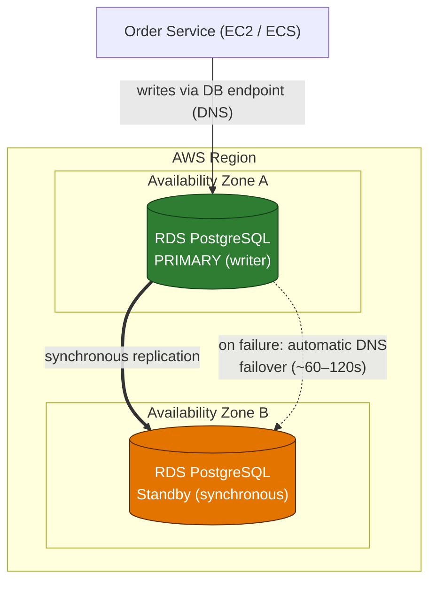
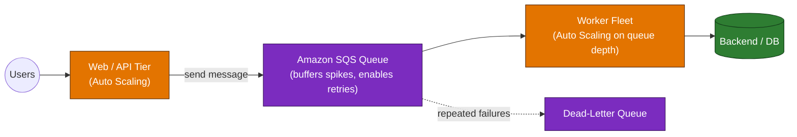
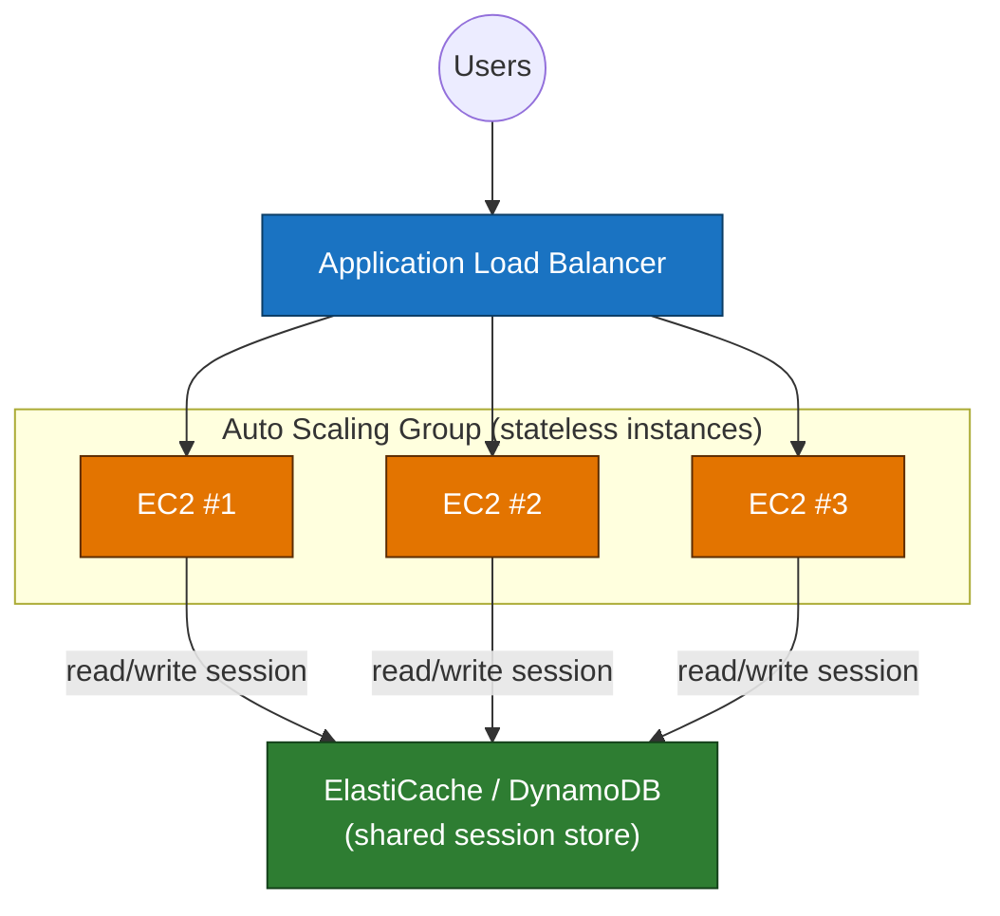
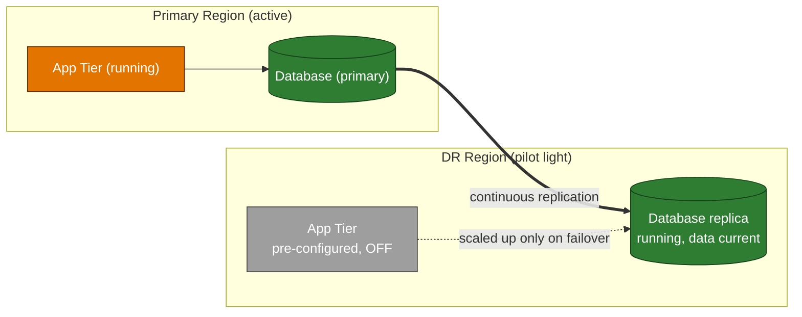
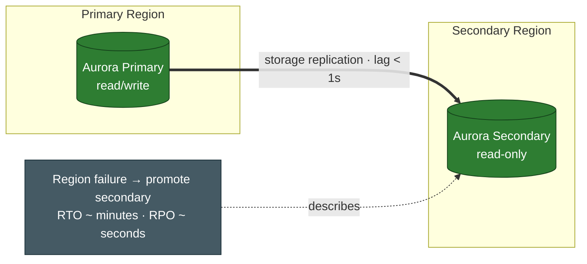

# Domain 2 — Design Resilient Architectures (26%)

---

## Q1 — Surviving an Availability Zone failure
**Domain:** 2 — Design Resilient Architectures · **Difficulty:** 🟡 Medium · **Concept:** Multi-AZ (synchronous standby, automatic failover) vs. read replica (asynchronous, read scaling).

**Scenario:** An e-commerce company runs its production order-processing database on **Amazon RDS for PostgreSQL** in a **single Availability Zone**. During a recent AZ disruption the database was unreachable for hours, halting checkout. The team needs the database to **fail over automatically to another AZ**, with **no data loss on committed transactions** and **no application code changes** to connection logic, at the **LEAST operational overhead**.

**Question:** Which approach provides the **HIGHEST availability** for this database?

**Options:**
- A. Create a **read replica** in a second AZ and **promote it manually** when the primary fails.
- B. **Increase the instance size** and enable **hourly automated snapshots**.
- C. Convert the instance to a **Multi-AZ deployment**; RDS maintains a **synchronous standby** in another AZ and fails over automatically.
- D. Deploy read replicas across **three AZs** behind a **Route 53 weighted record**.

▶ Reveal answer &amp; explanation

**✅ Correct answer: C**

**Concept tested:** The distinction between **Multi-AZ** (availability) and **read replicas** (read scaling/performance).

**Why C is correct:** A Multi-AZ deployment provisions a **synchronous standby** in a different AZ. Writes are committed to both before acknowledgment (so **no committed-data loss**), and on primary failure RDS **automatically flips the DNS endpoint** to the standby — typically within ~60–120 seconds — with **no change to the application's connection string**. Fully managed → lowest operational overhead.

**Why the others fail:**
- **A:** Read replicas are **asynchronous** (possible data loss on failover) and require **manual promotion** — downtime plus operational effort, and it doesn't meet "automatic."
- **B:** A bigger instance adds no redundancy; **snapshots are backups, not failover**, and hourly snapshots imply an RPO of up to an hour.
- **D:** Read replicas are **read-only** and **asynchronous**; Route 53 weighting distributes traffic but has no notion of promoting a writer. Wrong tool for write availability.

**Real-world nuance / trap:** The classic SAA trap is choosing a **read replica for high availability**. Replicas exist to **scale reads / offload the primary**, not to provide automatic failover. In a *classic* single-standby Multi-AZ **instance** deployment, the standby is **not readable** — it exists purely for failover.

**Time-sensitive note:** RDS also offers **Multi-AZ DB cluster** deployments (a semisynchronous cluster with **two readable standby instances** and typically faster failover, often under ~35 seconds), available since **2022**. It's a valid enhancement, but the direct answer to "convert this single-AZ instance to HA with least change" remains the classic **Multi-AZ instance** deployment.

**Well-Architected pillar:** Reliability.

**Diagram — correct architecture:**

---

## Q2 — Absorbing traffic spikes without overwhelming the backend
**Domain:** 2 — Design Resilient Architectures · **Difficulty:** 🟡 Medium · **Concept:** Decoupling tiers with a queue so spikes and failures don't cascade.

**Scenario:** A web tier calls a processing backend **synchronously**. During flash sales, request spikes overwhelm the backend, requests time out, and failed work is simply lost. The team wants the architecture to **absorb spikes, retry failed work, and scale the backend independently**, for the **MOST resilient** result.

**Question:** Which change makes the system **MOST resilient**?

**Options:**
- A. Vertically scale the backend EC2 instances to a larger size.
- B. Put an **Amazon SQS queue** between the web tier and the backend, and Auto Scale workers on **queue depth**.
- C. Replace the direct call with **Amazon SNS** fan-out to the backend.
- D. Keep the synchronous call but add client-side **retries** in the web tier.

▶ Reveal answer &amp; explanation

**✅ Correct answer: B**

**Concept tested:** **Queue-based decoupling** for load leveling, retries, and independent scaling.

**Why B is correct:** An SQS queue **buffers** bursts so the backend consumes at its own pace (load leveling). Messages that fail processing become **visible again for retry** and can move to a **dead-letter queue** after N attempts, so work isn't lost. Workers scale out/in on **queue depth**, independent of the web tier. This is the canonical resilient, loosely-coupled pattern.

**Why the others fail:**
- **A:** A bigger instance still has a fixed ceiling and doesn't add retries or decoupling — the spike just breaks a larger box.
- **C:** SNS is **push/fan-out** with no durable backlog for a slow consumer; if the backend can't keep up, messages aren't buffered the way a queue buffers them (the resilient pattern here is a buffer, not a broadcast).
- **D:** Synchronous retries against an already-overwhelmed backend add load and still block the web tier; failures during the outage window are still lost.

**Real-world nuance / trap:** SNS vs SQS — **SNS fans out** an event to many subscribers; **SQS buffers** work for one (scalable) consumer group. "Absorb spikes + retry" points to SQS. (A common combined pattern is SNS→SQS fan-out, but the buffering property comes from the queue.)

**Time-sensitive note:** None.

**Well-Architected pillar:** Reliability.

**Diagram — correct architecture:**

---

## Q3 — Keeping user sessions alive through Auto Scaling
**Domain:** 2 — Design Resilient Architectures · **Difficulty:** 🟡 Medium · **Concept:** Stateless instances by externalizing session state.

**Scenario:** A web app stores each user's **session data on the local instance**. When Auto Scaling terminates an instance during scale-in, those users are **logged out**. The team wants scaling to add and remove instances freely **without disrupting sessions**, for a **MORE resilient** design.

**Question:** What is the best way to prevent session loss during scaling?

**Options:**
- A. Enable **sticky sessions** on the load balancer.
- B. Store session data on an **EBS volume** attached to each instance.
- C. **Externalize** session state to a shared store such as **Amazon ElastiCache** or **DynamoDB**.
- D. **Disable Auto Scaling** so instances are never terminated.

▶ Reveal answer &amp; explanation

**✅ Correct answer: C**

**Concept tested:** **Stateless** application tiers — no user-specific state on the instance.

**Why C is correct:** Moving session state to a **shared, external store** (ElastiCache/DynamoDB) makes instances **stateless**: any instance can serve any request, and terminating one loses no sessions. This is the foundation that lets Auto Scaling (and instance failure) be non-disruptive.

**Why the others fail:**
- **A:** Sticky sessions pin a user to one instance, but when **that** instance is terminated the session is **still lost** — it doesn't solve scale-in.
- **B:** EBS volumes are tied to a single instance/AZ and are removed with the instance on scale-in; they don't share state across the fleet.
- **D:** Disabling Auto Scaling defeats elasticity and still doesn't protect against instance failure — the opposite of resilient.

**Real-world nuance / trap:** Sticky sessions are a frequent distractor — they improve cache locality but do **not** make the tier resilient to instance loss. The resilient move is **statelessness**.

**Time-sensitive note:** None.

**Well-Architected pillar:** Reliability.

**Diagram — correct architecture:**

---

## Q4 — Choosing a disaster-recovery strategy
**Domain:** 2 — Design Resilient Architectures · **Difficulty:** 🟠 Hard · **Concept:** DR strategy trade-offs (backup/restore, pilot light, warm standby, multi-site).

**Scenario:** A company needs a cross-region DR plan. Requirements: keep the DR database **continuously up to date** so data loss is minimal, recover within a **short scale-up window** (not hours), and keep **standby cost as low as possible** by not running a full duplicate of the fleet.

**Question:** Which DR strategy best fits at the **LOWEST standby cost** while still meeting the recovery window?

**Options:**
- A. **Backup and restore** — restore from cross-region backups when disaster strikes.
- B. **Multi-site active/active** — run the full workload in both Regions simultaneously.
- C. **Warm standby** — run a scaled-down but fully functional copy of the entire stack in the DR Region.
- D. **Pilot light** — replicate data continuously to a DR Region where core services (e.g., the database) are ready but application servers stay off until failover.

▶ Reveal answer &amp; explanation

**✅ Correct answer: D**

**Concept tested:** Matching **RTO/RPO and cost** to the four standard DR patterns.

**Why D is correct:** **Pilot light** keeps **data continuously replicated** (low RPO) and the **core** switched on, while the compute fleet is **pre-configured but powered off** — so standby cost is low. On failover you **scale up** the app tier, meeting a recovery window measured in minutes rather than hours. This is the best balance of the stated requirements: minimal data loss, short scale-up, lowest running cost.

**Why the others fail:**
- **A:** Backup and restore is the **cheapest** but has the **longest RTO** (rebuild + restore = hours) and higher RPO — it fails "recover within a short window."
- **B:** Multi-site active/active gives the **best RTO/RPO** but is the **most expensive** (a full second live copy) — it fails "lowest standby cost."
- **C:** Warm standby also meets the window but runs a **full (scaled-down) duplicate stack continuously**, costing more than pilot light — the requirement explicitly avoids running a duplicate fleet.

**Real-world nuance / trap:** These four sit on a cost-vs-RTO spectrum: backup/restore → pilot light → warm standby → multi-site (cheapest/slowest → priciest/fastest). Read the qualifiers: "lowest standby cost" plus "not hours" lands on **pilot light**.

**Time-sensitive note:** None.

**Well-Architected pillar:** Reliability.

**Diagram — correct architecture:**

---

## Q5 — Surviving a full Region outage for a database
**Domain:** 2 — Design Resilient Architectures · **Difficulty:** 🟡 Medium · **Concept:** Multi-AZ (single-Region) vs. cross-Region database resilience.

**Scenario:** A critical application uses **Amazon Aurora** in one Region. Leadership now requires the database to **survive a complete Region failure** with an **RPO of about one second** and fast cross-Region failover, with **low management overhead**.

**Question:** Which option meets the **cross-Region** requirement?

**Options:**
- A. Enable **Multi-AZ** for the Aurora cluster.
- B. Use an **Aurora Global Database** with a secondary Region.
- C. Create a **cross-Region read replica** and promote it manually during a disaster.
- D. Take **daily snapshots** and copy them to another Region.

▶ Reveal answer &amp; explanation

**✅ Correct answer: B**

**Concept tested:** Multi-AZ protects against an **AZ** failure; surviving a **Region** failure needs cross-Region replication.

**Why B is correct:** Aurora Global Database replicates at the **storage layer** to one or more secondary Regions with **typical lag under a second** (low RPO) and supports **fast cross-Region promotion** (RTO in minutes), all managed by Aurora. It's purpose-built for exactly this requirement.

**Why the others fail:**
- **A:** Multi-AZ only spans Availability Zones **within one Region** — a Region-wide outage takes it down.
- **C:** A cross-Region read replica can work but has **higher replication lag**, and **manual** promotion means more operational effort and slower, less predictable recovery than a Global Database.
- **D:** Daily snapshots imply an **RPO of up to 24 hours** — far worse than the ~1-second target.

**Real-world nuance / trap:** The classic trap is choosing **Multi-AZ** for "high availability" when the requirement is **Region** survival. Multi-AZ ≠ multi-Region.

**Time-sensitive note:** None.

**Well-Architected pillar:** Reliability.

**Diagram — correct architecture:**

---
