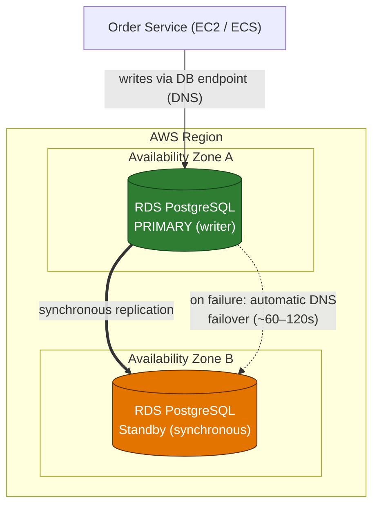

# Domain 2 — Design Resilient Architectures (26%)

---

## Q1 — Surviving an Availability Zone failure
**Domain:** 2 — Design Resilient Architectures · **Difficulty:** 🟡 Medium · **Concept:** Multi-AZ (synchronous standby, automatic failover) vs. read replica (asynchronous, read scaling).

**Scenario:** An e-commerce company runs its production order-processing database on **Amazon RDS for PostgreSQL** in a **single Availability Zone**. During a recent AZ disruption the database was unreachable for hours, halting checkout. The team needs the database to **fail over automatically to another AZ**, with **no data loss on committed transactions** and **no application code changes** to connection logic, at the **LEAST operational overhead**.

**Question:** Which approach provides the **HIGHEST availability** for this database?

**Options:**
- A. Create a **read replica** in a second AZ and **promote it manually** when the primary fails.
- B. **Increase the instance size** and enable **hourly automated snapshots**.
- C. Convert the instance to a **Multi-AZ deployment**; RDS maintains a **synchronous standby** in another AZ and fails over automatically.
- D. Deploy read replicas across **three AZs** behind a **Route 53 weighted record**.

▶ Reveal answer &amp; explanation

**✅ Correct answer: C**

**Concept tested:** The distinction between **Multi-AZ** (availability) and **read replicas** (read scaling/performance).

**Why C is correct:** A Multi-AZ deployment provisions a **synchronous standby** in a different AZ. Writes are committed to both before acknowledgment (so **no committed-data loss**), and on primary failure RDS **automatically flips the DNS endpoint** to the standby — typically within ~60–120 seconds — with **no change to the application's connection string**. Fully managed → lowest operational overhead.

**Why the others fail:**
- **A:** Read replicas are **asynchronous** (possible data loss on failover) and require **manual promotion** — downtime plus operational effort, and it doesn't meet "automatic."
- **B:** A bigger instance adds no redundancy; **snapshots are backups, not failover**, and hourly snapshots imply an RPO of up to an hour.
- **D:** Read replicas are **read-only** and **asynchronous**; Route 53 weighting distributes traffic but has no notion of promoting a writer. Wrong tool for write availability.

**Real-world nuance / trap:** The classic SAA trap is choosing a **read replica for high availability**. Replicas exist to **scale reads / offload the primary**, not to provide automatic failover. In a *classic* single-standby Multi-AZ **instance** deployment, the standby is **not readable** — it exists purely for failover.

**Time-sensitive note:** RDS also offers **Multi-AZ DB cluster** deployments (a semisynchronous cluster with **two readable standby instances** and typically faster failover, often under ~35 seconds), available since **2022**. It's a valid enhancement, but the direct answer to "convert this single-AZ instance to HA with least change" remains the classic **Multi-AZ instance** deployment.

**Well-Architected pillar:** Reliability.

**Diagram — correct architecture:**

---
