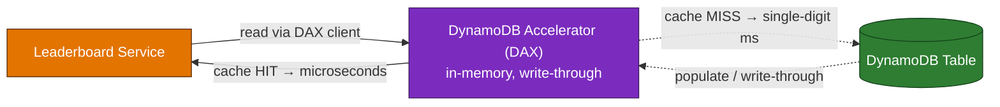

# Domain 3 — Design High-Performing Architectures (24%)

---

## Q1 — Microsecond reads for a hot leaderboard
**Domain:** 3 — Design High-Performing Architectures · **Difficulty:** 🟠 Hard · **Concept:** DynamoDB Accelerator (DAX) as a DynamoDB-native, in-memory, write-through cache.

**Scenario:** A gaming leaderboard is backed by **Amazon DynamoDB**. The workload is intensely read-heavy — the same "top players" items are read **millions of times per minute**, and the application **tolerates eventually consistent reads**. Read latency has crept into the **low single-digit milliseconds**, and the team wants **microsecond-level latency** for these repeated reads, with the **LEAST application change** and **without managing cache servers**.

**Question:** Which solution best delivers **microsecond read latency** for this workload?

**Options:**
- A. Deploy **Amazon ElastiCache for Redis** as a **cache-aside** layer in front of DynamoDB.
- B. Put **Amazon DynamoDB Accelerator (DAX)** in front of the table and point the app at the **DAX endpoint** using the DAX client.
- C. Add a **Global Secondary Index (GSI)** on the leaderboard attribute to speed up the reads.
- D. Enable **DynamoDB Global Tables** to add read replicas in other Regions.

▶ Reveal answer &amp; explanation

**✅ Correct answer: B**

**Concept tested:** Choosing the **purpose-built, fully managed** caching layer for DynamoDB.

**Why B is correct:** DAX is a **fully managed, in-memory, write-through cache designed specifically for DynamoDB**. It serves cached reads in **microseconds**, is **API-compatible** with DynamoDB (so the change is essentially swapping the client/endpoint — minimal code change), and **requires no cache servers to operate**. Its access pattern — repeated reads of the same hot items under eventual consistency — is exactly DAX's sweet spot.

**Why the others fail:**
- **A:** ElastiCache for Redis *can* cache DynamoDB data, but it forces you to write and maintain **cache-aside logic** (lookup, populate, invalidate) in the app and to operate a separate cache — **more change and more overhead** than DAX for a DynamoDB-native workload.
- **C:** A GSI enables **alternate query patterns / access on different keys**; it does not cache and does not reduce latency for reads that already use the table's key.
- **D:** Global Tables provide **multi-Region replication for locality and availability**, not microsecond latency for repeated **same-Region** reads.

**Real-world nuance / trap:** DAX accelerates **eventually consistent** reads. **Strongly consistent** reads bypass the item cache and go to the table, so they don't get the microsecond benefit — a detail exam items love to hinge on. This scenario explicitly allows eventual consistency, so DAX applies cleanly.

**Time-sensitive note:** None — DAX behavior here is stable.

**Well-Architected pillar:** Performance Efficiency.

**Diagram — correct architecture:**

---
