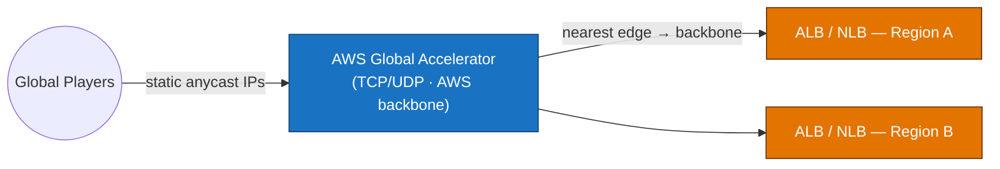
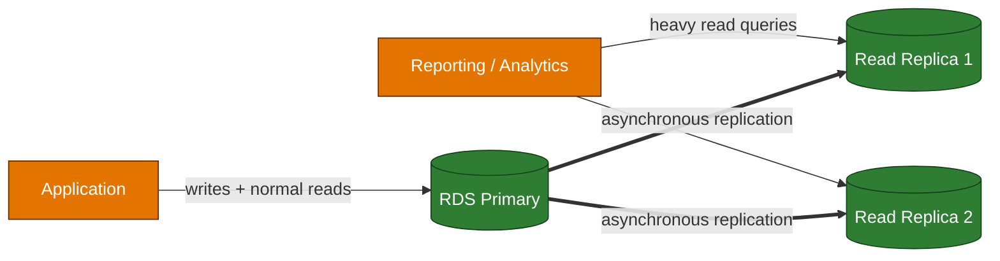
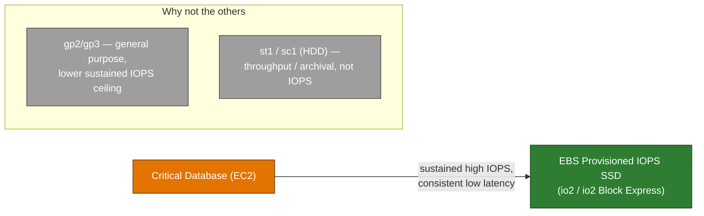
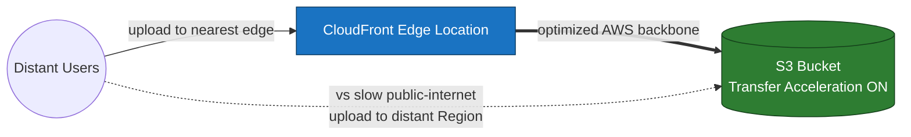

# Domain 3 — Design High-Performing Architectures (24%)

---

## Q1 — Microsecond reads for a hot leaderboard
**Domain:** 3 — Design High-Performing Architectures · **Difficulty:** 🟠 Hard · **Concept:** DynamoDB Accelerator (DAX) as a DynamoDB-native, in-memory, write-through cache.

**Scenario:** A gaming leaderboard is backed by **Amazon DynamoDB**. The workload is intensely read-heavy — the same "top players" items are read **millions of times per minute**, and the application **tolerates eventually consistent reads**. Read latency has crept into the **low single-digit milliseconds**, and the team wants **microsecond-level latency** for these repeated reads, with the **LEAST application change** and **without managing cache servers**.

**Question:** Which solution best delivers **microsecond read latency** for this workload?

**Options:**
- A. Deploy **Amazon ElastiCache for Redis** as a **cache-aside** layer in front of DynamoDB.
- B. Put **Amazon DynamoDB Accelerator (DAX)** in front of the table and point the app at the **DAX endpoint** using the DAX client.
- C. Add a **Global Secondary Index (GSI)** on the leaderboard attribute to speed up the reads.
- D. Enable **DynamoDB Global Tables** to add read replicas in other Regions.

▶ Reveal answer &amp; explanation

**✅ Correct answer: B**

**Concept tested:** Choosing the **purpose-built, fully managed** caching layer for DynamoDB.

**Why B is correct:** DAX is a **fully managed, in-memory, write-through cache designed specifically for DynamoDB**. It serves cached reads in **microseconds**, is **API-compatible** with DynamoDB (so the change is essentially swapping the client/endpoint — minimal code change), and **requires no cache servers to operate**. Its access pattern — repeated reads of the same hot items under eventual consistency — is exactly DAX's sweet spot.

**Why the others fail:**
- **A:** ElastiCache for Redis *can* cache DynamoDB data, but it forces you to write and maintain **cache-aside logic** (lookup, populate, invalidate) in the app and to operate a separate cache — **more change and more overhead** than DAX for a DynamoDB-native workload.
- **C:** A GSI enables **alternate query patterns / access on different keys**; it does not cache and does not reduce latency for reads that already use the table's key.
- **D:** Global Tables provide **multi-Region replication for locality and availability**, not microsecond latency for repeated **same-Region** reads.

**Real-world nuance / trap:** DAX accelerates **eventually consistent** reads. **Strongly consistent** reads bypass the item cache and go to the table, so they don't get the microsecond benefit — a detail exam items love to hinge on. This scenario explicitly allows eventual consistency, so DAX applies cleanly.

**Time-sensitive note:** None — DAX behavior here is stable.

**Well-Architected pillar:** Performance Efficiency.

**Diagram — correct architecture:**

---

## Q2 — Global performance for a latency-sensitive TCP API
**Domain:** 3 — Design High-Performing Architectures · **Difficulty:** 🟠 Hard · **Concept:** AWS Global Accelerator (TCP/UDP, anycast) vs. CloudFront (cacheable HTTP).

**Scenario:** A real-time multiplayer game exposes a **latency-sensitive, non-cacheable TCP API** hosted behind load balancers in two Regions. Players worldwide complain about inconsistent latency and connection drops over the public internet. The team wants **consistent low latency**, **fast regional failover**, and **static entry-point IPs** for the game clients.

**Question:** Which service best improves global performance for this workload?

**Options:**
- A. Put **Amazon CloudFront** in front of the API to accelerate it.
- B. Use **Route 53 latency-based routing** to send players to the nearest Region.
- C. Use **AWS Global Accelerator** with the regional load balancers as endpoints.
- D. Move players onto **larger instance types** to reduce processing time.

▶ Reveal answer &amp; explanation

**✅ Correct answer: C**

**Concept tested:** Global Accelerator routes traffic onto the **AWS global backbone** as close to the user as possible and provides **static anycast IPs** with **fast health-based failover** — ideal for **TCP/UDP, non-cacheable** traffic.

**Why C is correct:** Global Accelerator gives clients **two static anycast IPs**, enters the AWS backbone at the nearest edge (reducing jitter and hops versus the open internet), and **fails over between regional endpoints** quickly on health-check failure. For a non-cacheable, latency-sensitive TCP API, this is the right tool.

**Why the others fail:**
- **A:** CloudFront shines for **cacheable HTTP(S)** content; a **non-cacheable real-time TCP** API gets little benefit from a CDN cache.
- **B:** Route 53 latency routing works at the **DNS** layer only — it picks a Region but doesn't carry traffic over the backbone or give static IPs, and failover is bounded by DNS TTLs.
- **D:** Bigger instances address compute time, not the **network path** that's causing the latency/drops.

**Real-world nuance / trap:** CloudFront vs Global Accelerator is a favorite distinction — **CloudFront = cache HTTP content at the edge; Global Accelerator = accelerate TCP/UDP/dynamic traffic with static anycast IPs**.

**Time-sensitive note:** None.

**Well-Architected pillar:** Performance Efficiency.

**Diagram — correct architecture:**

---

## Q3 — Reporting queries are slowing the production database
**Domain:** 3 — Design High-Performing Architectures · **Difficulty:** 🟡 Medium · **Concept:** RDS read replicas for read scaling (vs. Multi-AZ for availability).

**Scenario:** An analytics team runs heavy **read-only reporting queries** directly against a production **Amazon RDS** primary, degrading performance for the main application. The team wants to **offload reporting reads** and scale read throughput with the **LEAST application change**.

**Question:** What is the best approach?

**Options:**
- A. Create **RDS read replicas** and point reporting/read traffic at them.
- B. Convert the database to **Multi-AZ**.
- C. **Vertically scale** the primary to a larger instance class.
- D. Add **DynamoDB Accelerator (DAX)** in front of the database.

▶ Reveal answer &amp; explanation

**✅ Correct answer: A**

**Concept tested:** **Read replicas** scale **read** workloads and offload the primary.

**Why A is correct:** RDS read replicas serve **read-only** traffic asynchronously replicated from the primary. Pointing the reporting workload at replicas removes that load from the primary and lets you **add more replicas** to scale reads — with minimal change (just a second connection endpoint for reads).

**Why the others fail:**
- **B:** Multi-AZ is for **availability/failover**; the standby in a classic Multi-AZ instance deployment is **not readable**, so it doesn't offload reporting.
- **C:** Vertical scaling has a ceiling, costs more continuously, and still runs reporting on the **same** instance as the app.
- **D:** DAX is a cache for **DynamoDB**, not RDS — wrong service for a relational database.

**Real-world nuance / trap:** The perennial flip — **Multi-AZ = availability, read replicas = read scaling/performance**. This question tests the *performance* side of that pair.

**Time-sensitive note:** None.

**Well-Architected pillar:** Performance Efficiency.

**Diagram — correct architecture:**

---

## Q4 — Storage for a database needing sustained high IOPS
**Domain:** 3 — Design High-Performing Architectures · **Difficulty:** 🟠 Hard · **Concept:** Matching EBS volume types to the workload.

**Scenario:** A mission-critical transactional database on EC2 requires **sustained, very high IOPS** with **consistent low latency**. General-purpose volumes occasionally can't keep up during peak load.

**Question:** Which EBS volume type best fits the requirement?

**Options:**
- A. **General Purpose SSD (gp2)**.
- B. **Throughput Optimized HDD (st1)**.
- C. **Cold HDD (sc1)**.
- D. **Provisioned IOPS SSD (io2 / io2 Block Express)**.

▶ Reveal answer &amp; explanation

**✅ Correct answer: D**

**Concept tested:** **Provisioned IOPS SSD** is designed for **I/O-intensive, latency-sensitive** workloads.

**Why D is correct:** io2 / io2 Block Express lets you **provision a specific, high IOPS level** with **consistent single-digit-millisecond latency** and high durability — the right choice for a critical database that must sustain heavy random I/O predictably.

**Why the others fail:**
- **A:** gp2 is fine for general workloads but its performance is tied to volume size/credits and can be inconsistent under sustained heavy IOPS (gp3 improves this, but for the **highest, most consistent** IOPS the answer is Provisioned IOPS).
- **B & C:** **HDD** volumes (st1, sc1) are optimized for **sequential throughput** and **cold/archival** data — they're a poor fit for high random **IOPS** and are not bootable for this use.

**Real-world nuance / trap:** IOPS-bound and latency-sensitive → **io2**. Throughput-bound (big sequential scans, logs, data warehouse) → **st1**. Rarely accessed/cheap → **sc1**. Match the **access pattern**, not just "fast = SSD."

**Time-sensitive note:** None.

**Well-Architected pillar:** Performance Efficiency.

**Diagram — correct architecture:**

---

## Q5 — Speeding up large uploads from distant users
**Domain:** 3 — Design High-Performing Architectures · **Difficulty:** 🟡 Medium · **Concept:** S3 Transfer Acceleration for long-distance uploads.

**Scenario:** Users around the world upload **large media files** to an S3 bucket in a single Region. Uploads from distant users are **slow and unreliable** over the public internet. The team wants to **speed up uploads** to that bucket with **minimal application change**.

**Question:** Which S3 feature best addresses this?

**Options:**
- A. Have all users upload directly to the single-Region bucket as-is.
- B. Enable **S3 Transfer Acceleration** on the bucket and use its accelerated endpoint.
- C. Only **compress** files on the client before upload.
- D. Route uploads through a large **EC2 proxy** in the bucket's Region.

▶ Reveal answer &amp; explanation

**✅ Correct answer: B**

**Concept tested:** **S3 Transfer Acceleration** uses CloudFront edge locations + the AWS backbone to speed **long-distance** transfers.

**Why B is correct:** Users upload to a **nearby edge location**, and S3 Transfer Acceleration carries the data to the bucket over the **optimized AWS network** instead of the open internet — improving throughput for distant users with only an **endpoint change** (and pairs well with multipart upload for large files).

**Why the others fail:**
- **A:** This is the status quo that's already slow.
- **C:** Compression may reduce bytes for some file types but doesn't fix the **network path** and doesn't help already-compressed media.
- **D:** An EC2 proxy adds cost and a bottleneck/single point of failure, and still relies on the same long-haul internet path to reach it.

**Real-world nuance / trap:** For **downloads/cacheable delivery** you'd reach for **CloudFront**; for **accelerating uploads to a specific bucket**, the targeted feature is **Transfer Acceleration**.

**Time-sensitive note:** None.

**Well-Architected pillar:** Performance Efficiency.

**Diagram — correct architecture:**

---
