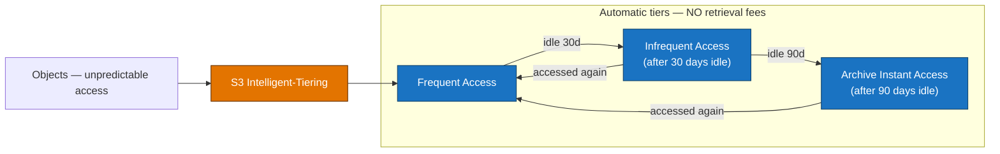

# Domain 4 — Design Cost-Optimized Architectures (20%)

---

## Q1 — Cheapest storage for unpredictable access
**Domain:** 4 — Design Cost-Optimized Architectures · **Difficulty:** 🟡 Medium · **Concept:** S3 Intelligent-Tiering for unknown/shifting access patterns.

**Scenario:** A media company stores **millions of user-uploaded assets** in **S3 Standard**. Access is genuinely **unpredictable** — some objects are hot for weeks and then go cold; others are suddenly requested again after months. The team does **not** want to build and tune lifecycle rules, and it must **avoid retrieval fees or latency penalties** when a "cold" object is unexpectedly accessed. They want the **MOST cost-effective** storage with **no operational overhead**.

**Question:** Which storage option best fits?

**Options:**
- A. Create a **lifecycle policy** transitioning objects to **S3 Glacier Flexible Retrieval** after 30 days.
- B. Move the objects to **S3 One Zone-IA**.
- C. Move the objects to **S3 Intelligent-Tiering**.
- D. Keep everything in **S3 Standard** and purchase a **savings plan**.

▶ Reveal answer &amp; explanation

**✅ Correct answer: C**

**Concept tested:** Matching **unknown/changing access patterns** to the storage class that auto-optimizes cost **without retrieval penalties**.

**Why C is correct:** S3 Intelligent-Tiering **automatically moves each object between access tiers based on its actual usage** and charges **no retrieval fees** when a cold object is accessed again. That precisely fits "unpredictable, occasionally-hot-again" data, and it requires **no lifecycle rules to design or maintain** → lowest operational overhead and lowest effective cost for this pattern.

**Why the others fail:**
- **A:** Glacier Flexible Retrieval assumes **archival** data and imposes **retrieval fees and latency**. For objects that unpredictably turn hot again, you'd pay retrieval costs and stall on restore times.
- **B:** One Zone-IA stores data in a **single AZ** (lower durability, unsuitable for important assets) and still charges **retrieval fees** and assumes *infrequent* access — which isn't guaranteed here.
- **D:** There is **no "savings plan" for S3 storage** (Savings Plans cover compute like EC2/Fargate/Lambda). Standard is also the **most expensive** tier and does nothing for the cold portion of the data.

**Real-world nuance / trap:** Intelligent-Tiering charges a small **per-object monitoring/automation fee** and does **not monitor objects smaller than 128 KB** (they stay billed at the frequent-access rate). For millions of larger media assets with shifting access, the auto-tiering savings dwarf that fee — but for huge numbers of tiny objects the monitoring charge can outweigh the benefit.

**Time-sensitive note:** None material — Intelligent-Tiering is stable (its automatic **Archive Instant Access** tier, still with no retrieval fee, has been part of it since late 2021).

**Well-Architected pillar:** Cost Optimization.

**Diagram — correct architecture:**

---
