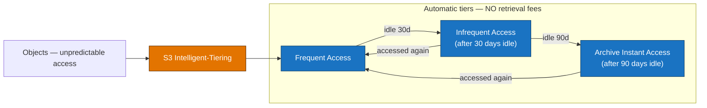
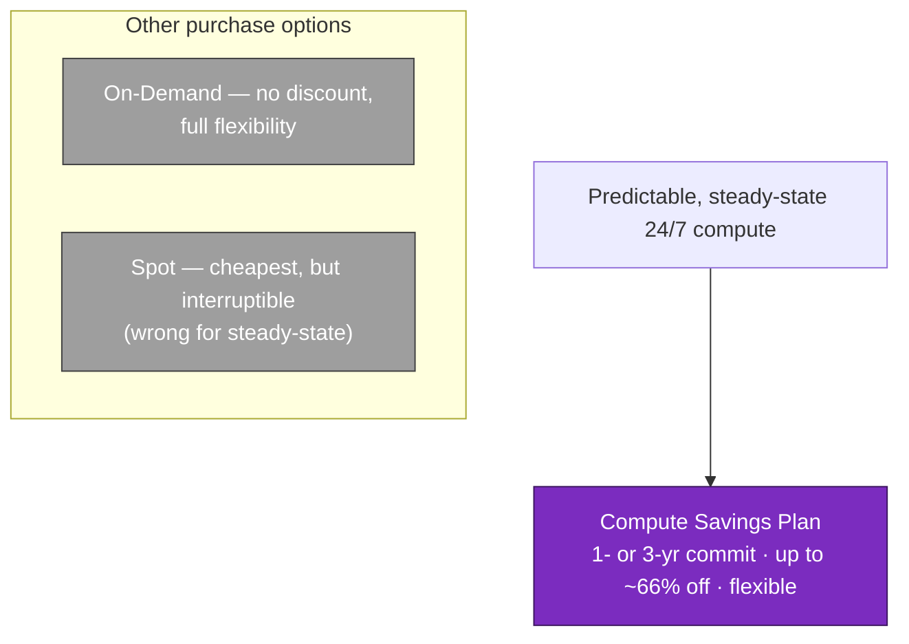
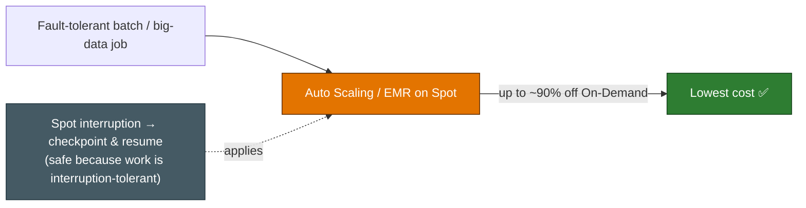
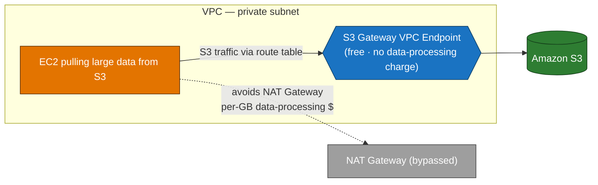

# Domain 4 — Design Cost-Optimized Architectures (20%)

---

## Q1 — Cheapest storage for unpredictable access
**Domain:** 4 — Design Cost-Optimized Architectures · **Difficulty:** 🟡 Medium · **Concept:** S3 Intelligent-Tiering for unknown/shifting access patterns.

**Scenario:** A media company stores **millions of user-uploaded assets** in **S3 Standard**. Access is genuinely **unpredictable** — some objects are hot for weeks and then go cold; others are suddenly requested again after months. The team does **not** want to build and tune lifecycle rules, and it must **avoid retrieval fees or latency penalties** when a "cold" object is unexpectedly accessed. They want the **MOST cost-effective** storage with **no operational overhead**.

**Question:** Which storage option best fits?

**Options:**
- A. Create a **lifecycle policy** transitioning objects to **S3 Glacier Flexible Retrieval** after 30 days.
- B. Move the objects to **S3 One Zone-IA**.
- C. Move the objects to **S3 Intelligent-Tiering**.
- D. Keep everything in **S3 Standard** and purchase a **savings plan**.

▶ Reveal answer &amp; explanation

**✅ Correct answer: C**

**Concept tested:** Matching **unknown/changing access patterns** to the storage class that auto-optimizes cost **without retrieval penalties**.

**Why C is correct:** S3 Intelligent-Tiering **automatically moves each object between access tiers based on its actual usage** and charges **no retrieval fees** when a cold object is accessed again. That precisely fits "unpredictable, occasionally-hot-again" data, and it requires **no lifecycle rules to design or maintain** → lowest operational overhead and lowest effective cost for this pattern.

**Why the others fail:**
- **A:** Glacier Flexible Retrieval assumes **archival** data and imposes **retrieval fees and latency**. For objects that unpredictably turn hot again, you'd pay retrieval costs and stall on restore times.
- **B:** One Zone-IA stores data in a **single AZ** (lower durability, unsuitable for important assets) and still charges **retrieval fees** and assumes *infrequent* access — which isn't guaranteed here.
- **D:** There is **no "savings plan" for S3 storage** (Savings Plans cover compute like EC2/Fargate/Lambda). Standard is also the **most expensive** tier and does nothing for the cold portion of the data.

**Real-world nuance / trap:** Intelligent-Tiering charges a small **per-object monitoring/automation fee** and does **not monitor objects smaller than 128 KB** (they stay billed at the frequent-access rate). For millions of larger media assets with shifting access, the auto-tiering savings dwarf that fee — but for huge numbers of tiny objects the monitoring charge can outweigh the benefit.

**Time-sensitive note:** None material — Intelligent-Tiering is stable (its automatic **Archive Instant Access** tier, still with no retrieval fee, has been part of it since late 2021).

**Well-Architected pillar:** Cost Optimization.

**Diagram — correct architecture:**

---

## Q2 — Cost model for steady-state, 24/7 compute
**Domain:** 4 — Design Cost-Optimized Architectures · **Difficulty:** 🟡 Medium · **Concept:** Purchase options — Savings Plans / Reserved vs. On-Demand vs. Spot.

**Scenario:** A company runs a **predictable, steady-state** production workload on EC2 **24/7**, and expects the usage to continue for at least the next **1–3 years**. They currently pay full **On-Demand** rates and want to **reduce cost** while keeping this always-on capacity, and they value **flexibility** to change instance families/sizes over time.

**Question:** Which purchasing option is **MOST cost-effective** for this usage?

**Options:**
- A. Commit to a **Compute Savings Plan** (1- or 3-year term).
- B. Continue paying **On-Demand** rates.
- C. Run the workload on **Spot Instances**.
- D. Use **Dedicated Hosts**.

▶ Reveal answer &amp; explanation

**✅ Correct answer: A**

**Concept tested:** Committing to **predictable baseline** usage for a large discount while retaining flexibility.

**Why A is correct:** For steady, always-on usage over 1–3 years, a **Compute Savings Plan** delivers a substantial discount versus On-Demand (up to ~66%) in exchange for an hourly spend commitment — and **Compute** Savings Plans apply **across instance families, sizes, Regions, and even Fargate/Lambda**, matching the "flexibility to change instance types" requirement. (Standard Reserved Instances discount similarly but are less flexible.)

**Why the others fail:**
- **B:** On-Demand is the **baseline price with no discount** — the situation they want to improve.
- **C:** Spot is the **cheapest** but instances can be **reclaimed with ~2 minutes' notice** — unsuitable for always-on, non-interruptible production capacity.
- **D:** Dedicated Hosts add cost for **compliance/licensing/isolation** needs, not general cost savings for steady-state compute.

**Real-world nuance / trap:** Map usage shape to pricing: **steady/predictable → Savings Plans or RIs; spiky/short → On-Demand; interruptible/fault-tolerant → Spot.** "Flexibility across families" specifically favors **Compute** Savings Plans over EC2 Instance Savings Plans or Standard RIs.

**Time-sensitive note:** None.

**Well-Architected pillar:** Cost Optimization.

**Diagram — correct architecture:**

---

## Q3 — Cheapest compute for interruption-tolerant batch work
**Domain:** 4 — Design Cost-Optimized Architectures · **Difficulty:** 🟡 Medium · **Concept:** Spot Instances for fault-tolerant, flexible workloads.

**Scenario:** A data team runs large **batch and big-data processing** jobs that are **fault-tolerant** and can **checkpoint and resume** if interrupted. The jobs are not time-critical and can run whenever capacity is available. The team wants the **LOWEST possible compute cost**.

**Question:** Which purchasing option delivers the **LOWEST cost** for this workload?

**Options:**
- A. **On-Demand** Instances.
- B. **Reserved Instances**.
- C. **Spot Instances** (e.g., via Auto Scaling or EMR).
- D. **Dedicated Instances**.

▶ Reveal answer &amp; explanation

**✅ Correct answer: C**

**Concept tested:** **Spot** trades interruptibility for the deepest discount — perfect for fault-tolerant, flexible work.

**Why C is correct:** Spot Instances use spare capacity at up to **~90% off** On-Demand. Because the jobs **tolerate interruption** (checkpoint/resume) and aren't time-critical, the main downside of Spot — reclamation — is acceptable, making it the lowest-cost choice. EMR and Auto Scaling groups support Spot natively.

**Why the others fail:**
- **A:** On-Demand is convenient but the **most expensive per hour** for this flexible workload.
- **B:** Reserved Instances suit **steady 24/7** usage under commitment, not bursty batch jobs that run "whenever" — you'd pay for reserved capacity you don't continuously use.
- **D:** Dedicated Instances cost **more** (isolation), the opposite of the goal.

**Real-world nuance / trap:** Spot is defined by **workload tolerance**, not by size — the phrase "fault-tolerant / can resume" is the signal that Spot is safe here.

**Time-sensitive note:** None.

**Well-Architected pillar:** Cost Optimization.

**Diagram — correct architecture:**

---

## Q4 — Cutting NAT costs for private instances reading from S3
**Domain:** 4 — Design Cost-Optimized Architectures · **Difficulty:** 🟠 Hard · **Concept:** S3 gateway VPC endpoint to remove NAT data-processing charges.

**Scenario:** EC2 instances in **private subnets** download **large volumes of data from Amazon S3**. All of that S3 traffic currently flows through a **NAT gateway**, generating significant **data-processing charges per GB**. The team wants to **reduce cost** without exposing the instances to the internet.

**Question:** What is the **MOST cost-effective** change?

**Options:**
- A. Provision a **larger NAT gateway** to handle the volume.
- B. Create an **S3 gateway VPC endpoint** so S3 traffic bypasses the NAT gateway.
- C. Move the instances to **public subnets** with public IPs.
- D. Route the S3 traffic through an **internet gateway** directly.

▶ Reveal answer &amp; explanation

**✅ Correct answer: B**

**Concept tested:** **Gateway VPC endpoints** for S3 keep traffic on the AWS network **and are free**, removing NAT data-processing costs.

**Why B is correct:** A gateway endpoint adds an S3 route to the subnet's route table so S3 traffic goes **directly over AWS's private network** — it **doesn't traverse the NAT gateway**, eliminating the per-GB NAT **data-processing** charges. Gateway endpoints themselves have **no hourly or data charge**. The instances stay private. Lowest cost, most secure.

**Why the others fail:**
- **A:** A bigger NAT gateway still **charges per GB processed** — you'd pay even more as volume grows.
- **C:** Public subnets/public IPs **expose the instances** and change the security posture; it also doesn't inherently reduce data costs.
- **D:** You can't point private instances straight at an internet gateway without public addressing, and it still routes over the internet path rather than the S3 endpoint.

**Real-world nuance / trap:** NAT gateways bill **both** an hourly rate **and** per-GB processed; large S3/DynamoDB pulls from private subnets are a classic hidden cost that a **free gateway endpoint** removes. (Note this same endpoint also improves security — cost and security align here.)

**Time-sensitive note:** None.

**Well-Architected pillar:** Cost Optimization.

**Diagram — correct architecture:**

---
